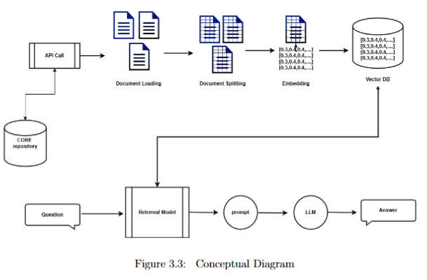
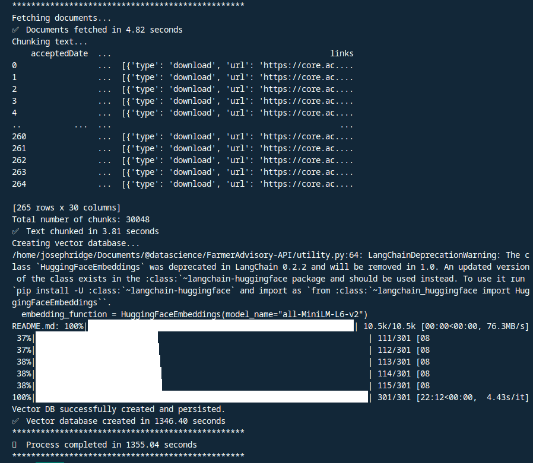

# Architecture:



---

Running:  
`fastapi dev main.py`


## **Endpoints:** 

**path**: `{BASE_URL}/fetch-data`

**Output**:
```json
    {
    "documents": {
        "time_taken": 13.44028902053833,
        "chunk": 30048,
        "chroma_vector_DB_status": "created",
        "data": [
        {
            "acceptedDate": "",
            "arxivId": null,
            "authors": [
            {
                "name": "Kipkirui, Edwin"
            },
            {
                "name": "Seif, Salum Kamota"
            }
            ],
            "citationCount": 0,
            "contributors": [],
            "outputs": [
            "https://api.core.ac.uk/v3/outputs/603903781"
            ],
            "createdDate": "2024-05-11T23:27:42",
            "dataProviders": [
            {
                "id": 22377,
                "name": "",
                "url": "https://api.core.ac.uk/v3/data-providers/22377",
                "logo": "https://api.core.ac.uk/data-providers/22377/logo"
            }
            ],
            "depositedDate": "",
            "abstract": "Methane emissions from livestock being a major contributor to climate change as methane possesses more global warming potential than carbon dioxide, exacerbating the issue. Therefore....",
            "documentType": "",
            "doi": "10.59324/ejtas.2024.2(2).44",
            "downloadUrl": "https://core.ac.uk/download/603903781.pdf",
            "fieldOfStudy": null,
            "fullText": "  This work is licensed under a Creative Commons Attribution 4.0 International License. The license permits unrestricted use, distribution, and reproduction in any medium, on the condition.....",
            "id": 156076121,
            "identifiers": [
            {
                "identifier": "oai:ejtas.com:article/794",
                "type": "OAI_ID"
            },
            {
                "identifier": "10.59324/ejtas.2024.2(2).44",
                "type": "DOI"
            },
            {
                "identifier": "603903781",
                "type": "CORE_ID"
            }
            ],
            "title": "Harnessing Tanzania's Rangelands to Mitigate Methane Emissions from Livestock Enteric Fermentation",
            "language": {
            "code": "en",
            "name": "English"
            },
            "magId": null,
            "oaiIds": [
            "oai:ejtas.com:article/794"
            ],
            "publishedDate": "2024-03-01T00:00:00",
            "publisher": "AMO Publisher",
            "pubmedId": null,
            "references": [],
            "sourceFulltextUrls": [
            "https://ejtas.com/index.php/journal/article/download/794/585"
            ],
            "updatedDate": "2024-05-11T23:27:42",
            "yearPublished": 2024,
            "journals": [],
            "links": [
            {
                "type": "download",
                "url": "https://core.ac.uk/download/603903781.pdf"
            },
            {
                "type": "reader",
                "url": "https://core.ac.uk/reader/603903781"
            },
            {
                "type": "thumbnail_m",
                "url": "https://core.ac.uk/image/603903781/large"
            },
            {
                "type": "thumbnail_l",
                "url": "https://core.ac.uk/image/603903781/large"
            },
            {
                "type": "display",
                "url": "https://core.ac.uk/works/156076121"
            }
            ]
        },
        {
            "acceptedDate": "",
            "arxivId": null,
            "authors": [
                .................]
        }]

        
    }}
```

## **Insights:**



- Data Ingestion Module: 
Features: 
- Fetch data from CORE
- Chunk the data 
- Create Embeddings

Time taken:
- Whole procedure: 23 minutes
- Articles: 264 (took 4.82 secs to fetch)
- Chunks: 30048 (took 3.81 secs to chunk - Recursively)  